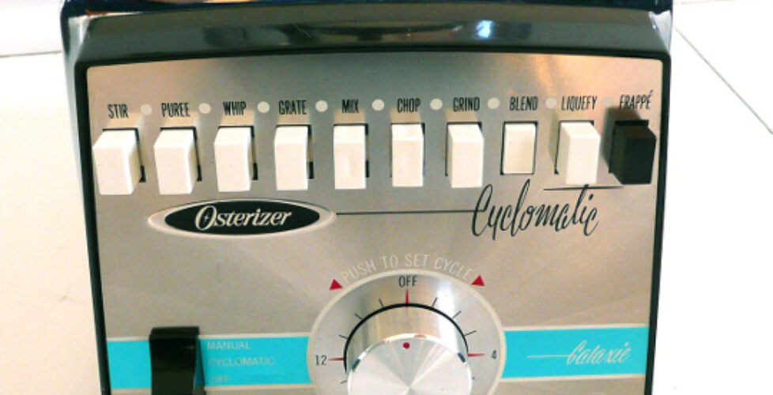
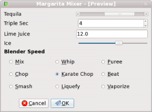

# Test PyQt4 GUIs with QTest and unittest



[PyQt](http://www.riverbankcomputing.co.uk/software/pyqt/intro) is the Python binding of the popular [Qt cross-platform UI and application framework](https://www.qt.io/). For unit testing, PyQt clients are expected to use the standard [Python unittest module](https://docs.python.org/3/library/unittest.html), with just a little help from the PyQt `QtTest` module.  It is not immediately apparent how to blend these two frameworks into a unified unit testing strategy.  This project shows you how to unit test a PyQt GUI dialog using only modules included in PyQt and Python.

While the Qt C++ API includes a complete unit testing framework, the PyQt `QtTest` module contains only the `QTest` class, with static methods to simulate keystrokes, mouse clicks, and mouse movement.

Testing a GUI dialog requires only the keystroke methods to type strings into `QLineEdit` widgets, and mouse clicks to click the _OK_ button.  In more sophisticated drawing or layout applications, the mouse click and movement methods can be used to simulate drawing or dragging gestures.

## The margarita mixer dialog

For this example I used Qt Designer to create the user interface for a cocktail mixing machine.  To avoid temptation, I chose margaritas because I do not like them so much.



In the upper portion of the dialog, the user specifies the number of jiggers for each ingredient (1 jigger = 0.0444 liters).  In the lower portion, the user selects from blender speeds with names even weirder than those appearing on a real Oster Galaxie Cyclomatic blender.  After specifying the amounts and blender speed, the user clicks _OK_, and an as-yet unimplemented machine creates the refreshing product.

## PyQt QTest example files

The example code is in directory `/src/` of this GitHub repository:

* `MargaritaMixer.ui` is the XML output of Qt Designer. It describes the design of the GUI dialog.
* `Ui_MargaritaMixer.py` is the Python source code file that describes the design of the GUI dialog. It is created from the above Qt Designer output file using the command:

```
cd src/
pyuic4 --output Ui_MargaritaMixer.py MargaritaMixer.ui
```
* `MargaritaMixer.py` contains the class that instantiates the GUI dialog and processes the results
* `MargaritaMixerTest.py` is the unit test

## Unit test program

Enough [flair bartending](https://www.tiktok.com/@youssefgarroudi/video/7149954964457032966) with the wacky margarita mixer.  This article is all about the unit test in file `src/MargaritaMixerTest.py`.

### Imports

First import the required modules and classes, including of course the module under test, `MargaritaMixer`:

```
import sys
import unittest
from PyQt4.QtGui import QApplication
from PyQt4.QtTest import QTest
from PyQt4.QtCore import Qt
import MargaritaMixer
```

### Test the dialog defaults

The first test checks each of the default values of the dialog, pushes the _OK_ button, and checks the volume returned by `jiggers`:

```
def test_defaults(self):
   '''Test the GUI in its default state'''
   self.assertEqual(self.form.ui.tequilaScrollBar.value(), 8)
   self.assertEqual(self.form.ui.tripleSecSpinBox.value(), 4)
   self.assertEqual(self.form.ui.limeJuiceLineEdit.text(), "12.0")
   self.assertEqual(self.form.ui.iceHorizontalSlider.value(), 12)
   self.assertEqual(self.form.ui.speedButtonGroup.checkedButton().text(), "&Karate Chop")

   # Class is in the default state even without pressing OK
   self.assertEqual(self.form.jiggers, 36.0)
   self.assertEqual(self.form.speedName, "&Karate Chop")

   # Push OK with the left mouse button
   okWidget = self.form.ui.buttonBox.button(self.form.ui.buttonBox.Ok)
   QTest.mouseClick(okWidget, Qt.LeftButton)
   self.assertEqual(self.form.jiggers, 36.0)
   self.assertEqual(self.form.speedName, "&Karate Chop")
```

### Test PyQt QScrollBar

To test whether each ingredient appears in the total volume returned by `jiggers`, the test sets all ingredients to zero, sets the ingredient under test to some nonzero value, then calls `jiggers`.

For convenience `setFormToZero()` sets all fields to zero:

```
def setFormToZero(self):
    '''Set all ingredients to zero in preparation for setting just one
     to a nonzero value.
     '''
     self.form.ui.tequilaScrollBar.setValue(0)
     self.form.ui.tripleSecSpinBox.setValue(0)
     self.form.ui.limeJuiceLineEdit.setText("0.0")
     self.form.ui.iceHorizontalSlider.setValue(0)
```

Next test the scroll bar that determines the number of jiggers of tequila. Test the minimum and maximum values and then try a legal value:

```
def test_tequilaScrollBar(self):
    '''Test the tequila scroll bar'''
    self.setFormToZero()

    # Test the maximum. This one goes to 11.
    self.form.ui.tequilaScrollBar.setValue(12)
    self.assertEqual(self.form.ui.tequilaScrollBar.value(), 11)

    # Test the minimum of zero.
    self.form.ui.tequilaScrollBar.setValue(-1)
    self.assertEqual(self.form.ui.tequilaScrollBar.value(), 0)

    self.form.ui.tequilaScrollBar.setValue(5)

    # Push OK with the left mouse button
    okWidget = self.form.ui.buttonBox.button(self.form.ui.buttonBox.Ok)
    QTest.mouseClick(okWidget, Qt.LeftButton)
    self.assertEqual(self.form.jiggers, 5)
```

### Test PyQt QDialogButtonBox

Note how in the previous and subsequent examples, `QTest.mouseClick()` is used to actually click on the center of the _OK_ button:

```
okWidget = self.form.ui.buttonBox.button(self.form.ui.buttonBox.Ok)
    QTest.mouseClick(okWidget, Qt.LeftButton)
    self.assertEqual(self.form.jiggers, 5)
```

### Test PyQt QSpinBox

Next, set the triple sec spin box alone to a nonzero value and verify the result:

```
def test_tripleSecSpinBox(self):
    '''Test the triple sec spin box.
    Testing the minimum and maximum is left as an exercise for the reader.
    '''
    self.setFormToZero()
    self.form.ui.tripleSecSpinBox.setValue(2)

    # Push OK with the left mouse button
    okWidget = self.form.ui.buttonBox.button(self.form.ui.buttonBox.Ok)
    QTest.mouseClick(okWidget, Qt.LeftButton)
    self.assertEqual(self.form.jiggers, 2)
```

### Test PyQt QLineEdit

Use `QTest.keyClicks()` to actually type a string into the lime juice line edit widget:

```
def test_limeJuiceLineEdit(self):
    '''Test the lime juice line edit.
    Testing the minimum and maximum is left as an exercise for the reader.
    '''
    self.setFormToZero()
    # Clear and then type "3.5" into the lineEdit widget
    self.form.ui.limeJuiceLineEdit.clear()
    QTest.keyClicks(self.form.ui.limeJuiceLineEdit, "3.5")

    # Push OK with the left mouse button
    okWidget = self.form.ui.buttonBox.button(self.form.ui.buttonBox.Ok)
    QTest.mouseClick(okWidget, Qt.LeftButton)
    self.assertEqual(self.form.jiggers, 3.5)
```

I used `QTest.keyClicks()` merely because this article emphasizes QtTest.  I think the test would be just as valid if the widget text were set directly using `QLineEdit.setText():`

```
self.form.ui.limeJuiceLineEdit.setText("3.5")
```

### Test PyQt QSlider

Test the ice slider:

```
def test_iceHorizontalSlider(self):
    '''Test the ice slider.
    Testing the minimum and maximum is left as an exercise for the reader.
    '''
    self.setFormToZero()
    self.form.ui.iceHorizontalSlider.setValue(4)

    # Push OK with the left mouse button
    okWidget = self.form.ui.buttonBox.button(self.form.ui.buttonBox.Ok)
    QTest.mouseClick(okWidget, Qt.LeftButton)
    self.assertEqual(self.form.jiggers, 4)
```

### Test PyQt QRadioButton

The blender speed radio buttons are in a `QButtonGroup`. Test every button because it is very easy to leave one of them outside the button group:

```
def test_blenderSpeedButtons(self):
    '''Test the blender speed buttons'''
    self.form.ui.speedButton1.click()
    self.assertEqual(self.form.speedName, "&Mix")
    self.form.ui.speedButton2.click()
    self.assertEqual(self.form.speedName, "&Whip")
    self.form.ui.speedButton3.click()
    self.assertEqual(self.form.speedName, "&Puree")
    self.form.ui.speedButton4.click()
    self.assertEqual(self.form.speedName, "&Chop")
    self.form.ui.speedButton5.click()
    self.assertEqual(self.form.speedName, "&Karate Chop")
    self.form.ui.speedButton6.click()
    self.assertEqual(self.form.speedName, "&Beat")
    self.form.ui.speedButton7.click()
    self.assertEqual(self.form.speedName, "&Smash")
    self.form.ui.speedButton8.click()
    self.assertEqual(self.form.speedName, "&Liquefy")
    self.form.ui.speedButton9.click()
    self.assertEqual(self.form.speedName, "&Vaporize")
```

## Running the MargaritaMixer PyQt QtTest example code

MargaritaMixer is tested with PyQt4, Python 2.7 and Python 3.4.  To download
and run the unit test:

```
git clone git@github.com:jmcgeheeiv/pyqttestexample.git
cd pyqttestexample/src
python MargaritaMixerTest.py
```

If you change the `pyqttestexample/src/MargaritaMixer.ui` user interface 
definition (such as with Qt Designer), you will need to recreate 
`Ui_MargaritaMixer.py` before running MargaritaMixer again:

```
pyuic4 --output Ui_MargaritaMixer.py MargaritaMixer.ui
```

## Comments from the blog article converted to issues

This material was originally presented as sample code here on GitHub and a separate blog post https://johnnado.com/pyqt-qtest-example/. The blog post has been migrated here so that everything is unified here on GitHub.

The blog post accumulated comments containing useful solutions. These comments have been converted to GitHub issues:

* A user asked **how to test event handlers**. Another user proposed a solution. The entire discussion appears in GitHub issue #2.
* A user found it easier to **test using pytest** because you can scope your fixtures. The entire discussion appears in GitHub issue #3.
* A user found a way to **test launching and accepting results from modal dialogs**. The entire discussion appears in GitHub issue #4.
* A user asks for a good way to **test the `getSaveFileName()` dialog**. The entire discussion appears in GitHub issue #5.

